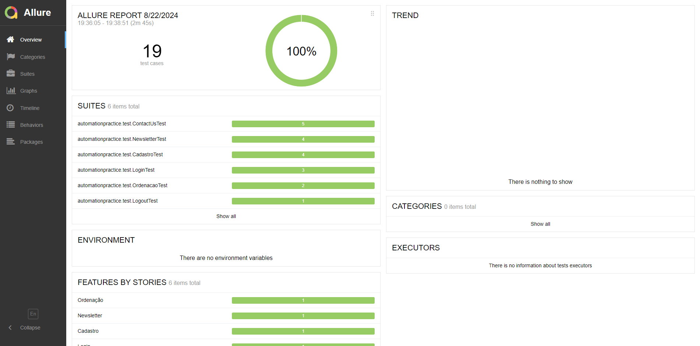

# Automação de Testes de UI - Plataforma Automation Practice

- URL da aplicação: http://automationpractice.com/index.php
- Tecnologia utilizada: Selenium WebDriver + JUnit 5 com Java

## Como baixar o projeto?
    Clone o repositório com o comando: 
    git clone https://github.com/jp-bonetti/processo-seletivo.git

## Como executar o projeto?
    - Abra o projeto em uma IDE de sua preferência
    - Clique com o botão direito no pacote test, e selecione a opção "Run tests"
    - Os testes serão executados e o relatório será gerado na pasta "allure-results" no projeto
    - Para visualizar o relatório, instale o Allure, e execute o comando "allure serve" no terminal
    - O relatório será aberto no navegador padrão, como mostrado abaixo:

# Funcionalidades mapeadas

- LOGIN
- LOGOUT
- CADASTRAR USUÁRIO
- CONTACT US
- ATUALIZAR INFORMAÇÕES DE PERFIL
- INSCRIÇÃO NEWSLETTER
- ORDENAÇÃO

# Casos de teste:
## - Login:
    US: Como usuário do sistema, desejo realizar login na aplicação

    CT001: Realizar login com dados válidos
    DADO que estou na página home
    E clico no botao "Sign in"
    E preencho o campo email com email cadastrado
    E preencho o campo senha com uma senha válida
    QUANDO clico no botão Sign in
    ENTÃO sou direcionado para a tela "My Account".

    CT002: Realizar login com email inválido
    DADO que estou na página home
    E clico no botao "Sign in"
    E preencho o campo email com email não cadastrado
    E preencho o campo senha com uma senha válida
    QUANDO clico no botão Sign in
    ENTÃO a mensagem "Authentication failed." deve ser exibida na tela.

    CT003: Realizar login com senha inválida
    DADO que estou na página home
    E clico no botao "Sign in"
    E preencho o campo email com email cadastrado
    E preencho o campo senha com uma senha inválida
    QUANDO clico no botão Sign in
    ENTÃO a mensagem "Authentication failed." deve ser exibida na tela.

## - Logout
    US: Como usuário logado do sistema, desejo fazer logout na aplicação

    CT001: Realizar logout
    DADO que estou logado na aplicação
    E estou na página home
    QUANDO clico no botão "Sign out"
    ENTÃO a opção "Sign in" deve aparecer novamente. 

## - Cadastro:
    US: Como usuário do sistema, desejo me cadastrar na aplicação;

    CT001: Realizar cadastro 
    DADO que estou na página home
    E clico no botao "Sign in"
    E preencho o campo email em "Create an account"
    E clico no botão "Create an account"
    E seleciono uma opção em "Title"
    E preencho o campo "First name"
    E preencho o campo "Last name"
    E preencho o campo "Password"
    E preencho o dia de nascimento
    E preenhco o mês de nascimento
    E preencho o ano de nascimento
    QUANDO clico no botão "Register"
    ENTÃO a mensagem "Your account has been created." deve ser exibida na tela.

    CT002: Realizar cadastro sem preencher nome
    DADO que estou na página home
    E clico no botao "Sign in"
    E preencho o campo email em "Create an account"
    E clico no botão "Create an account"
    E seleciono uma opção em "Title"
    E deixo o campo "First name" em branco
    E preencho o campo "Last name"
    E preencho o campo "Password"
    E preencho o dia de nascimento
    E preenhco o mês de nascimento
    E preencho o ano de nascimento
    QUANDO clico no botão "Register"
    ENTÃO a mensagem "firstname is required." deve ser exibida na tela.
    
    CT003: Realizar cadastro sem preencher senha
    DADO que estou na página home
    E clico no botao "Sign in"
    E preencho o campo email em "Create an account"
    E clico no botão "Create an account"
    E seleciono uma opção em "Title"
    E preencho o campo "First name"
    E preencho o campo "Last name"
    E deixo o campo "Password" em branco
    E preencho o dia de nascimento
    E preenhco o mês de nascimento
    E preencho o ano de nascimento
    QUANDO clico no botão "Register"
    ENTÃO a mensagem "passwd is required" deve ser exibida na tela.

    CT004: Realizar cadastro com e-mail duplicado
    DADO que estou na página home
    E clico no botao "Sign in"
    E preencho o campo email em "Create an account"
    QUANDO clico no botão "Create an account"
    ENTÃO a mensagem "An account using this email address has already been registered. 
    Please enter a valid password or request a new one." deve ser exibida na tela.

## - Contact Us:
    US: Como usuário do sistema, desejo poder enviar mensagens para o provedor da plataforma
    
    CT001: Enviar mensagem utilizando dados válidos
    DADO que estou na pagina inicial
    E clico no botão "Contact us"
    E seleciono uma opção no "Subject Heading"
    E preencho o campo e-mail corretamente
    E preencho o campo "Order reference" corretamente
    E preencho o campo "Message" corretamente
    QUANDO clico no botão "Send"
    ENTÃO a mensagem "Your message has been successfully sent to our team." deve ser exibida na tela.

    CT002: Enviar mensagem sem preencher o campo "Subject Heading"
    DADO que estou na pagina inicial
    E clico no botão "Contact us"
    E não seleciono uma opção no "Subject Heading"
    E preencho o campo "E-mail address" corretamente
    E preencho o campo "Order reference" corretamente
    E preencho o campo "Message" corretamente
    QUANDO clico no botão "Send"
    ENTÃO a mensagem "Please select a subject from the list provided." deve ser exibida na tela.

    CT003: Enviar mensagem sem preencher o campo "E-mail address"
    DADO que estou na pagina inicial
    E clico no botão "Contact us"
    E seleciono uma opção no "Subject Heading"
    E deixo o campo "E-mail address" em branco
    E preencho o campo "Order reference" corretamente
    E preencho o campo "Message" corretamente
    QUANDO clico no botão "Send"
    ENTÃO a mensagem "Invalid email address." deve ser exibida na tela.

    CT004: Enviar mensagem sem preencher o campo "Message"
    DADO que estou na pagina inicial
    E clico no botão "Contact us"
    E seleciono uma opção no "Subject Heading"
    E preencho o campo e-mail corretamente
    E preencho o campo "Order reference" corretamente
    E deixo o campo "Message" em branco
    QUANDO clico no botão "Send"
    ENTÃO a mensagem "The message cannot be blank." deve ser exibida na tela.

    CT005: Enviar mensagem utilizando e-mail inválido
    DADO que estou na pagina inicial
    E clico no botão "Contact us"
    E seleciono uma opção no "Subject Heading"
    E preencho o campo e-mail inválido (sem "@")
    E preencho o campo "Order reference" corretamente
    E preencho o campo "Message" corretamente
    QUANDO clico no botão "Send"
    ENTÃO a mensagem "Invalid email address." deve ser exibida na tela.

## - Incrição Newsletter
    US: Como usuário do sistema, desejo poder me inscrever na Newsletter

    CT001: Inscrição na Newsletter
    DADO que estou na página inicial
    E preencho o campo "Enter your e-mail" da Newsletter corretamente
    QUANDO clico no botão de enviar
    ENTÃO a mensagem "Newsletter : You have successfully subscribed to this newsletter." deve ser exibida na tela.

    CT002: Inscrição na Newsletter utilizando e-mail duplicado
    DADO que estou na página inicial
    E preencho o campo "Enter your e-mail" da Newsletter com um e-mail já cadastrado
    QUANDO clico no botão de enviar
    ENTÃO a mensagem "Newsletter : This email address is already registered." deve ser exibida na tela.

    CT003: Inscrição na Newsletter sem enviar e-mail
    DADO que estou na página inicial
    E deixo o campo "Enter your e-mail" da Newsletter em branco
    QUANDO clico no botão de enviar
    ENTÃO a mensagem "Newsletter : Invalid email address." deve ser exibida na tela.

    CT004: Inscrição na Newsletter utilizando e-mail inválido
    DADO que estou na página inicial
    E preencho o campo "Enter your e-mail" da Newsletter com um e-mail inválido (sem "@")
    QUANDO clico no botão de enviar
    ENTÃO a mensagem "Newsletter : Invalid email address." deve ser exibida na tela.

## - Ordenação
    US: Como usuário do sistema, desejo poder alterar a ordenação dos produtos exibidos

    CT001: Ordenar os produtos pelo menor preço
    DADO que estou na página inicial
    E clico no botão "Women"
    QUANDO preencho o campo "Sort by" com a opção "Price: Lowest first"
    ENTÃO o preço do primeiro produto exibido deve ser menor ou igual ao preço do segundo produto exibido

    CT002: Ordenar os produtos pelo maior preço
    DADO que estou na página inicial
    E clico no botão "Women"
    QUANDO preencho o campo "Sort by" com a opção "Price: Highest first"
    ENTÃO o preço do primeiro produto exibido deve ser maior ou igual ao preço do segundo produto exibido